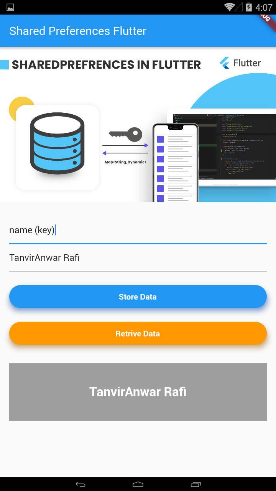

# SharedPreferences Flutter

This project is for learning how to use sharedpreferences in Flutter App Development.

### SharedPreferences
  - Insert Data
  - Read Data
 
## Screenshots
 &nbsp;&nbsp;&nbsp;&nbsp;&nbsp;&nbsp;&nbsp;&nbsp;&nbsp;&nbsp; 
